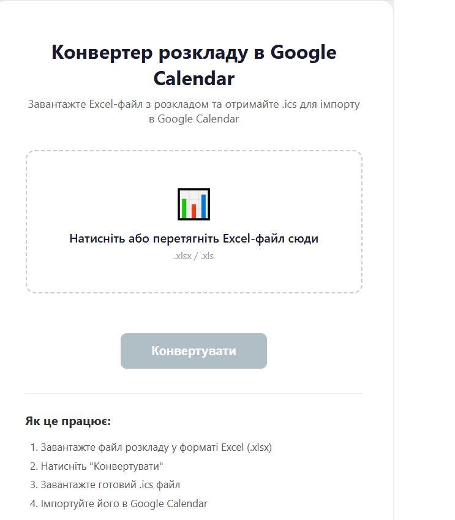

# 📅 Conv-Schedule

> Schedule converter developed with Python and Flask.  
> Web application for transforming Excel timetables into calendar files (.ics).


[](https://conv-schedule.vercel.app)

---

## 🌐 Live Demo

👉 https://conv-schedule.vercel.app

---

## 📖 About

**Conv-Schedule** is a lightweight web application designed to convert academic or work schedules from Excel (`.xlsx`) into calendar files (`.ics`).  
These files can be imported into Google Calendar, Outlook, or any other calendar service.

---

## ✨ Features

- ✅ Upload Excel timetable files  
- ✅ Automatic conversion to `.ics` format  
- ✅ Support for multiple Excel parsers (`pandas`, `openpyxl`, `xlrd`)  
- ✅ Export ready‑to‑use calendar files  
- ✅ Simple and responsive Flask interface  
- ✅ Easy deployment on Vercel or Render  

---

## 📷 Screenshots

### Upload & Convert


### Generated Calendar File


---

## 🏗 Architecture

```text
┌─────────────────────┐
│ Flask (Python)      │
│ Backend + Frontend  │
└──────────┬──────────┘
           │
           ▼
┌─────────────────────┐
│ Excel Parsers       │
│ pandas / openpyxl   │
└──────────┬──────────┘
           │
           ▼
   ICS Generator (ics library)

🛠 Tech Stack
Python

Flask

pandas / openpyxl / xlrd

ics (calendar generation)

Vercel / Render (deployment)
